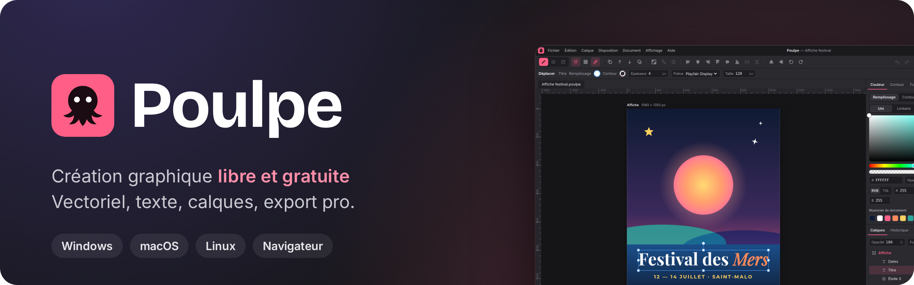
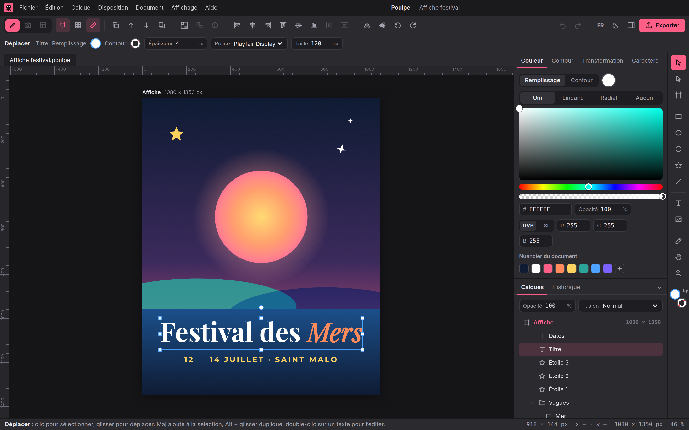
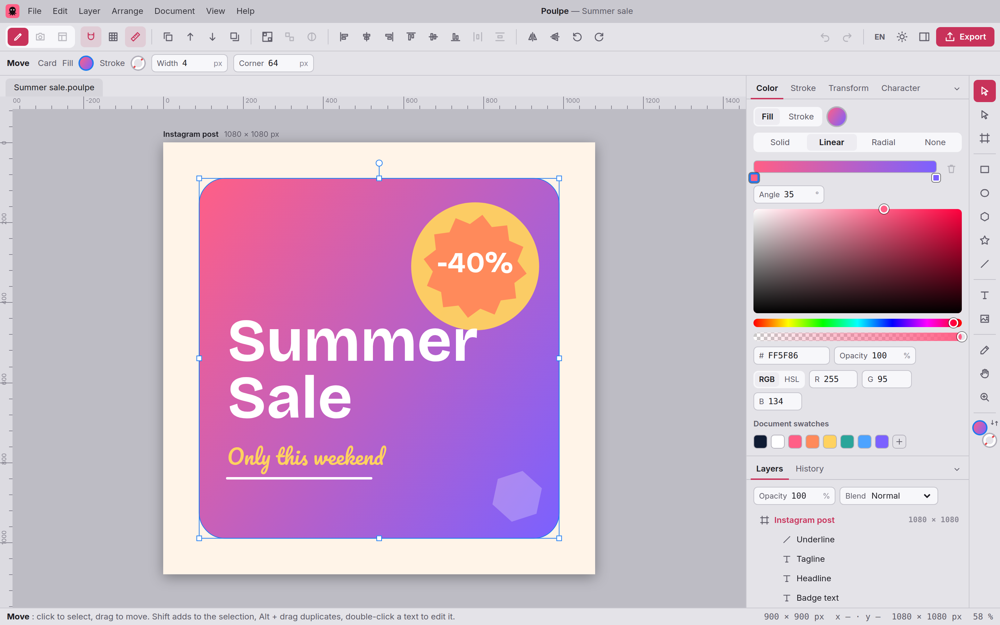
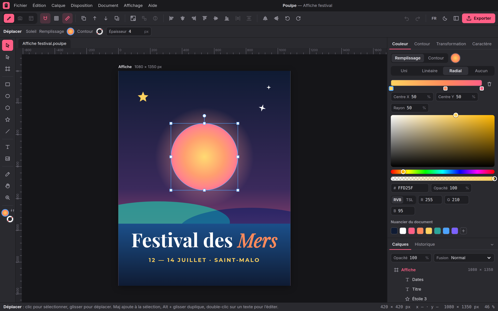

<p align="center">
  
</p>

<p align="center">
  <a href="https://github.com/KAYO74/Poulpe/releases/latest"></a>
  <a href="https://github.com/KAYO74/Poulpe/actions/workflows/ci.yml"></a>
  <a href="LICENSE"></a>
  
  
</p>

<p align="center">
  <b>Poulpe</b> est une application libre et gratuite de création graphique.<br>
  La puissance d'Affinity, Illustrator et Photoshop, la simplicité de Canva.
</p>

<p align="center">
  <a href="#installer-poulpe"><b>Installer</b></a> ·
  <a href="#fonctionnalités">Fonctionnalités</a> ·
  <a href="#feuille-de-route">Feuille de route</a> ·
  <a href="#contribuer">Contribuer</a> ·
  <a href="docs/installer.md">Guide d'installation</a>
</p>

<p align="center">
  
</p>

> [!NOTE]
> Poulpe est jeune : la version 0.1 pose le moteur d'édition. Le nom est provisoire.

## Installer Poulpe

Choisissez votre système, le téléchargement démarre directement.

| Système                          | Télécharger                                                                                                                                                                                                                                          |
| -------------------------------- | ---------------------------------------------------------------------------------------------------------------------------------------------------------------------------------------------------------------------------------------------------- |
| **Windows** 10 et 11             | <a href="https://github.com/KAYO74/Poulpe/releases/latest/download/Poulpe_windows_x64-setup.exe"></a>                |
| **macOS**, puces Apple (M1 à M4) | <a href="https://github.com/KAYO74/Poulpe/releases/latest/download/Poulpe_darwin_aarch64.dmg"></a> |
| **macOS**, processeur Intel      | <a href="https://github.com/KAYO74/Poulpe/releases/latest/download/Poulpe_darwin_x64.dmg"></a>           |
| **Linux**, Ubuntu et Debian      | <a href="https://github.com/KAYO74/Poulpe/releases/latest/download/Poulpe_linux_amd64.deb"></a>        |
| **Linux**, autres distributions  | <a href="https://github.com/KAYO74/Poulpe/releases/latest/download/Poulpe_linux_amd64.AppImage"></a>          |

Toutes les versions et l'installeur Windows `.msi` sont sur la page [Versions](https://github.com/KAYO74/Poulpe/releases).

L'appli n'est pas encore signée : au premier lancement, Windows et macOS affichent un avertissement. Le [guide d'installation](docs/installer.md) explique comment l'ouvrir quand même, en deux clics.

## Fonctionnalités

<table>
  <tr>
    <td width="50%"></td>
    <td width="50%"></td>
  </tr>
  <tr>
    <td align="center">Thème clair, interface en anglais</td>
    <td align="center">Dégradés, outils à gauche ou à droite</td>
  </tr>
</table>

- **Formes** : rectangles à coins arrondis, ellipses, polygones, étoiles, lignes, avec poignées de redimensionnement et de rotation, magnétisme, règles, repères et grille.
- **Texte** : 7 polices libres fournies et les polices de l'ordinateur, styles différents à l'intérieur d'un même texte (police, taille, gras, italique, couleur), interlettrage, interligne, alignement.
- **Couleurs** : sélecteur précis, saisie hexadécimale, RVB ou TSL, nuancier du document, dégradés linéaires et radiaux.
- **Calques** : groupes, masques, verrouillage, opacité et 16 modes de fusion.
- **Images** : import par glisser-déposer et recadrage.
- **Fichiers** : format ouvert `.poulpe`, export PNG, JPEG, SVG et PDF avec les polices intégrées, brouillon gardé automatiquement si la fenêtre se ferme.
- **Interface façon Affinity** : thème sombre ou clair, barre contextuelle, Studio à onglets, outils à droite par défaut ou à gauche, français ou anglais.
- **Local d'abord** : vos fichiers restent sur votre ordinateur et l'appli fonctionne sans connexion.

## Feuille de route

| Version | Contenu                                                                | État          |
| ------- | ---------------------------------------------------------------------- | ------------- |
| v0.1    | Moteur d'édition, export, appli de bureau                              | ✅ Disponible |
| v0.2    | Côté Canva : modèles, bibliothèque d'éléments, formats réseaux sociaux | 🚧 En cours   |
| v0.3    | Vectoriel pro (Illustrator, Affinity Designer)                         | Prévu         |
| v0.4    | Retouche photo (Photoshop, Affinity Photo)                             | Prévu         |
| v0.5    | Mise en page et export pro (Affinity Publisher, impression)            | Prévu         |
| v1.0    | Version stable, appli signée avec mises à jour automatiques            | Prévu         |

Le détail est dans la [feuille de route des fonctionnalités](docs/feuille-de-route.md).

## Contribuer

Poulpe est écrit en TypeScript (React, Vite) et embarqué dans une appli de bureau [Tauri](https://v2.tauri.app/). Il faut Node 20 ou plus et pnpm 10 (`corepack enable`).

```sh
pnpm install
pnpm dev            # éditeur dans le navigateur : http://localhost:5173
pnpm test           # tests du moteur
pnpm e2e            # tests de bout en bout
pnpm desktop:dev    # appli de bureau (Rust et dépendances Tauri requis)
```

| Dossier           | Rôle                                                                    |
| ----------------- | ----------------------------------------------------------------------- |
| `packages/core`   | Modèle de document, commandes, historique, export SVG, format `.poulpe` |
| `packages/render` | Rendu sur canevas, export PNG et JPEG                                   |
| `apps/editor`     | Interface façon Affinity (React + Vite)                                 |
| `apps/desktop`    | Appli de bureau Tauri 2                                                 |

Pour publier une nouvelle version, on change le numéro dans `apps/desktop/src-tauri/tauri.conf.json`, puis on ouvre l'onglet **Actions > Installeurs de bureau > Run workflow** et on indique l'étiquette (par exemple `v0.2.0`) ; pousser l'étiquette avec git marche aussi. GitHub fabrique les installeurs et les publie, et les boutons de téléchargement ci-dessus pointent tout seuls vers la nouvelle version.

### Documentation

- [Guide d'installation](docs/installer.md)
- [Moteur d'édition v0.1 : état et organisation du code](docs/moteur-v0.1.md)
- [Format de fichier `.poulpe`](docs/format-poulpe.md)
- [Cadrage et architecture](docs/cadrage-architecture.md)
- [Maquette de l'interface v3](design/maquette-v3.html) (voir [design/README.md](design/README.md))

## Licence

Poulpe est un logiciel libre distribué sous [Mozilla Public License 2.0](LICENSE).
