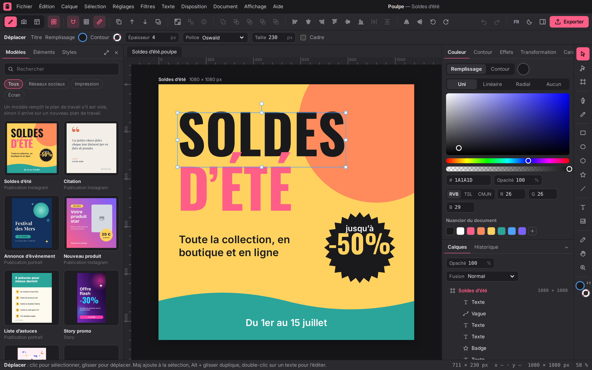
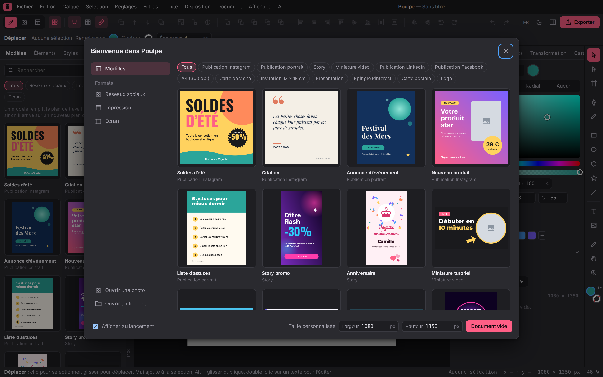
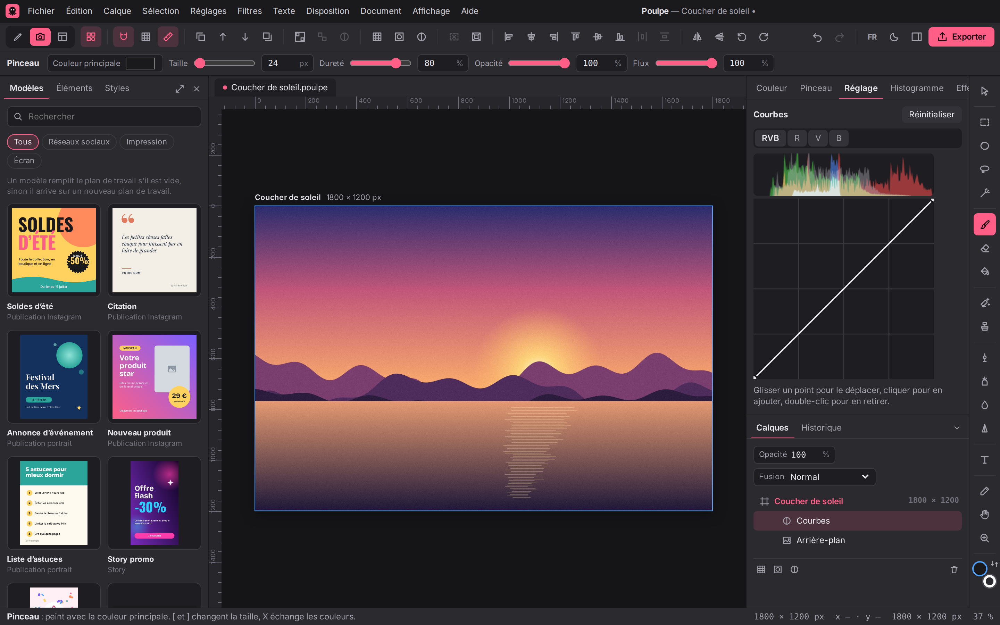
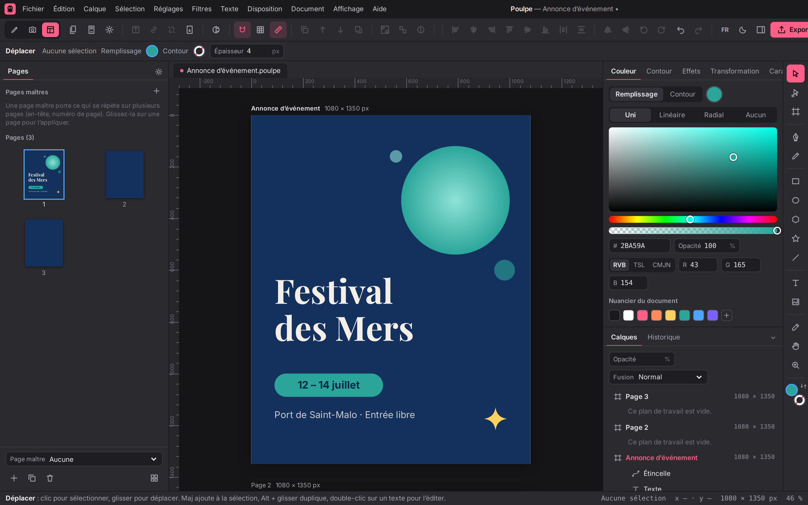

<p align="center">
  
</p>

<p align="center">
  <a href="https://github.com/KAYO74/Poulpe/releases/latest"></a>
  <a href="https://github.com/KAYO74/Poulpe/actions/workflows/ci.yml"></a>
  <a href="LICENSE"></a>
  
  
</p>

<p align="center">
  <b>Poulpe</b> est une application libre et gratuite de création graphique.<br>
  La puissance d'Affinity, Illustrator et Photoshop, la simplicité de Canva.
</p>

<p align="center">
  <a href="#installer-poulpe"><b>Installer</b></a> ·
  <a href="#fonctionnalités">Fonctionnalités</a> ·
  <a href="#feuille-de-route">Feuille de route</a> ·
  <a href="#contribuer">Contribuer</a> ·
  <a href="docs/installer.md">Guide d'installation</a>
</p>

<p align="center">
  
</p>

> [!NOTE]
> Poulpe est jeune : la version 0.5 réunit dessin vectoriel, retouche photo et mise en page, mais tout n'est pas encore là. Le nom est provisoire.

## Installer Poulpe

Choisissez votre système, le téléchargement démarre directement.

| Système                          | Télécharger                                                                                                                                                                                                                                          |
| -------------------------------- | ---------------------------------------------------------------------------------------------------------------------------------------------------------------------------------------------------------------------------------------------------- |
| **Windows** 10 et 11             | <a href="https://github.com/KAYO74/Poulpe/releases/latest/download/Poulpe_windows_x64-setup.exe"></a>                |
| **macOS**, puces Apple (M1 à M4) | <a href="https://github.com/KAYO74/Poulpe/releases/latest/download/Poulpe_darwin_aarch64.dmg"></a> |
| **macOS**, processeur Intel      | <a href="https://github.com/KAYO74/Poulpe/releases/latest/download/Poulpe_darwin_x64.dmg"></a>           |
| **Linux**, Ubuntu et Debian      | <a href="https://github.com/KAYO74/Poulpe/releases/latest/download/Poulpe_linux_amd64.deb"></a>        |
| **Linux**, autres distributions  | <a href="https://github.com/KAYO74/Poulpe/releases/latest/download/Poulpe_linux_amd64.AppImage"></a>          |

Toutes les versions et l'installeur Windows `.msi` sont sur la page [Versions](https://github.com/KAYO74/Poulpe/releases).

L'appli n'est pas encore signée : au premier lancement, Windows et macOS affichent un avertissement. Le [guide d'installation](docs/installer.md) explique comment l'ouvrir quand même, en deux clics.

## Fonctionnalités

<table>
  <tr>
    <td width="50%"></td>
    <td width="50%"></td>
  </tr>
  <tr>
    <td align="center">Modèles prêts à l'emploi, façon Canva</td>
    <td align="center">Retouche photo avec calques de réglage</td>
  </tr>
  <tr>
    <td width="50%"></td>
    <td width="50%"></td>
  </tr>
  <tr>
    <td align="center">Mise en page sur plusieurs pages</td>
    <td align="center">Thème clair, interface en anglais</td>
  </tr>
</table>

Trois espaces de travail, comme dans Affinity, qu'on change d'un clic en haut à gauche.

**Dessin**

- **Formes et tracés** : rectangles, ellipses, polygones, étoiles, lignes, plume, crayon et outil Nœud, opérations de géométrie (union, soustraction, intersection…), contours pointillés et flèches.
- **Texte** : polices fournies et polices de l'ordinateur, styles différents dans un même texte, texte sur un tracé, conversion en courbes.
- **Couleurs et effets** : dégradés linéaires et radiaux, nuancier, palettes, ombres, lueurs et flou.
- **Calques** : groupes, masques, opacité et 16 modes de fusion.

**Côté Canva**

- **Écran d'accueil** avec des modèles prêts à l'emploi et une vingtaine de formats (Instagram, story, YouTube, A4, carte de visite…).
- **Bibliothèque** d'éléments, de styles de texte et de palettes, cadres photo, et **redimensionnement** d'un design vers un autre format.

**Photo**

- **Pinceaux, gomme, sélections** (rectangle, ellipse, lasso, baguette magique) et **gomme magique** qui efface un objet en reconstruisant le fond, sans connexion.
- **Calques de réglage** (courbes, niveaux, teinte et saturation, balance des blancs…), **filtres** (flou, netteté, bruit, vignettage…), **masques de calque** et histogramme.

**Mise en page et impression**

- **Pages, pages maîtres, numéros de page** et cadres de texte liés d'une page à l'autre.
- **CMJN**, épreuvage à l'écran, **PDF pour l'imprimerie** (PDF/X-4, fond perdu, traits de coupe).

**Fichiers**

- Format ouvert `.poulpe`, export PNG, JPEG, SVG, PDF et PSD, export par lots.
- **Ouverture des fichiers Photoshop (.psd), PDF et Illustrator (.ai)**, import SVG.
- Vos fichiers restent sur votre ordinateur, l'appli fonctionne sans connexion, en français ou en anglais.

## Feuille de route

| Version | Contenu                                                                                       | État          |
| ------- | --------------------------------------------------------------------------------------------- | ------------- |
| v0.1    | Moteur d'édition, export, appli de bureau                                                     | ✅ Disponible |
| v0.2    | Côté Canva : modèles, bibliothèque d'éléments, formats réseaux sociaux                        | ✅ Disponible |
| v0.3    | Vectoriel pro : plume, nœuds, géométrie, effets (Illustrator, Affinity Designer)              | ✅ Disponible |
| v0.4    | Retouche photo : pinceaux, sélections, réglages, gomme magique (Photoshop, Affinity Photo)    | ✅ Disponible |
| v0.5    | Mise en page et impression : pages, CMJN, PDF/X, fichiers PSD, PDF et AI (Affinity Publisher) | ✅ Disponible |
| v1.0    | Version stable, appli signée avec mises à jour automatiques                                   | 🚧 En cours   |

Le détail est dans la [feuille de route des fonctionnalités](docs/feuille-de-route.md).

## Contribuer

Poulpe est écrit en TypeScript (React, Vite) et embarqué dans une appli de bureau [Tauri](https://v2.tauri.app/). Il faut Node 20 ou plus et pnpm 10 (`corepack enable`).

```sh
pnpm install
pnpm dev            # éditeur dans le navigateur : http://localhost:5173
pnpm test           # tests du moteur
pnpm e2e            # tests de bout en bout
pnpm desktop:dev    # appli de bureau (Rust et dépendances Tauri requis)
```

| Dossier            | Rôle                                                                    |
| ------------------ | ----------------------------------------------------------------------- |
| `packages/core`    | Modèle de document, commandes, historique, export SVG, format `.poulpe` |
| `packages/render`  | Rendu sur canevas, export PNG et JPEG                                   |
| `packages/library` | Modèles, éléments, palettes et formats du côté Canva                    |
| `apps/editor`      | Interface façon Affinity (React + Vite)                                 |
| `apps/desktop`     | Appli de bureau Tauri 2                                                 |

Pour publier une nouvelle version, on change le numéro de version (dans `apps/desktop/src-tauri/tauri.conf.json`, `Cargo.toml` et les `package.json`), puis on ouvre l'onglet **Actions > Installeurs de bureau > Run workflow** et on indique l'étiquette (par exemple `v0.2.0`) ; pousser l'étiquette avec git marche aussi. GitHub fabrique les installeurs et les publie, et les boutons de téléchargement ci-dessus pointent tout seuls vers la nouvelle version.

### Documentation

- [Guide d'installation](docs/installer.md)
- [Moteur d'édition v0.1](docs/moteur-v0.1.md), [Côté Canva v0.2](docs/cote-canva-v0.2.md), [Vectoriel pro v0.3](docs/vectoriel-pro-v0.3.md), [Retouche photo v0.4](docs/retouche-photo-v0.4.md), [Mise en page v0.5](docs/mise-en-page-v0.5.md) et [Impression v0.5](docs/impression-v0.5.md) : état et organisation du code
- [Format de fichier `.poulpe`](docs/format-poulpe.md)
- [Cadrage et architecture](docs/cadrage-architecture.md)
- [Maquette de l'interface v3](design/maquette-v3.html) (voir [design/README.md](design/README.md))

## Licence

Poulpe est un logiciel libre distribué sous [Mozilla Public License 2.0](LICENSE).
